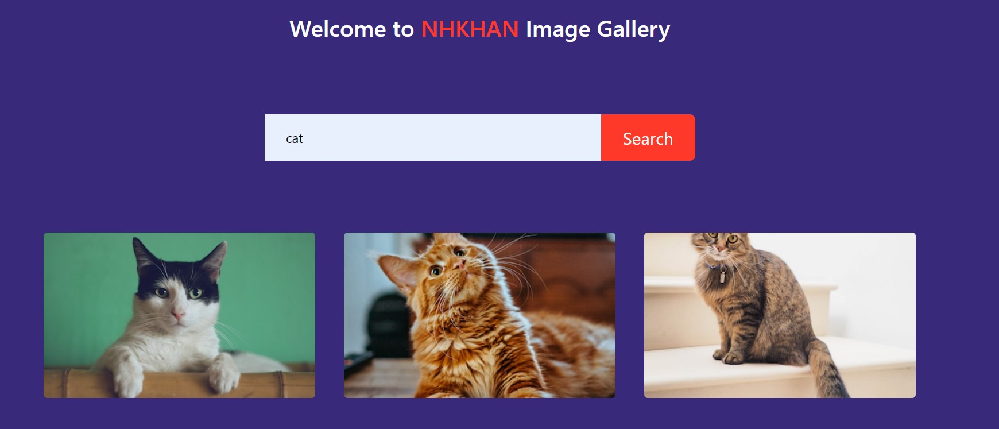

## Image Gallery Using Unsplash API 

### My Learning:
* In Mini Project, i have learnt how to use api in your project
* How create element and add append child through JS.
* Need to implement __show-more__ button functionlity. In Progress.. 
And many more. I have already so many **comments with the code** for understanding.

## Here are the screenShot of Mini project:

#### page-2:

#### page-3:

#### page-4:

#### page-5:

